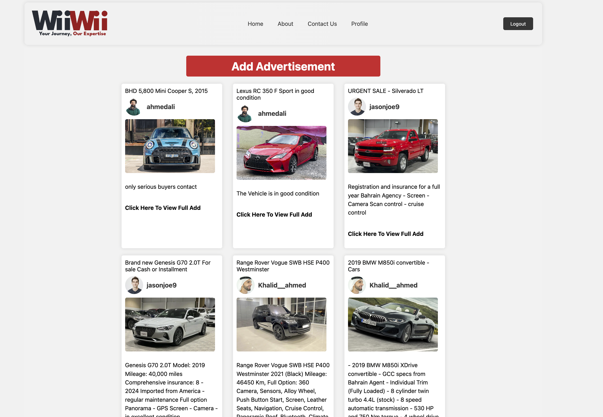
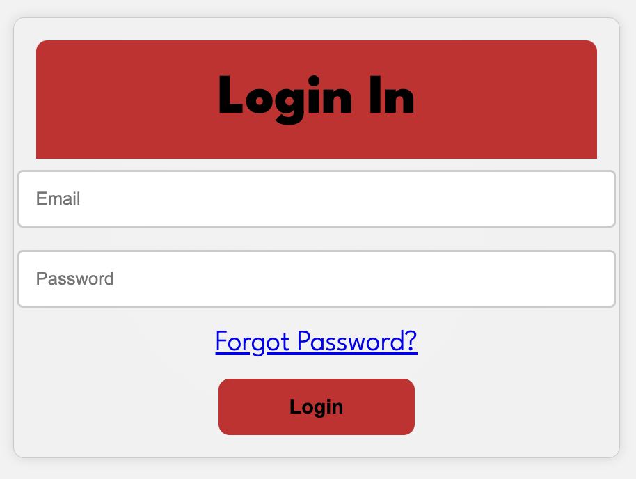
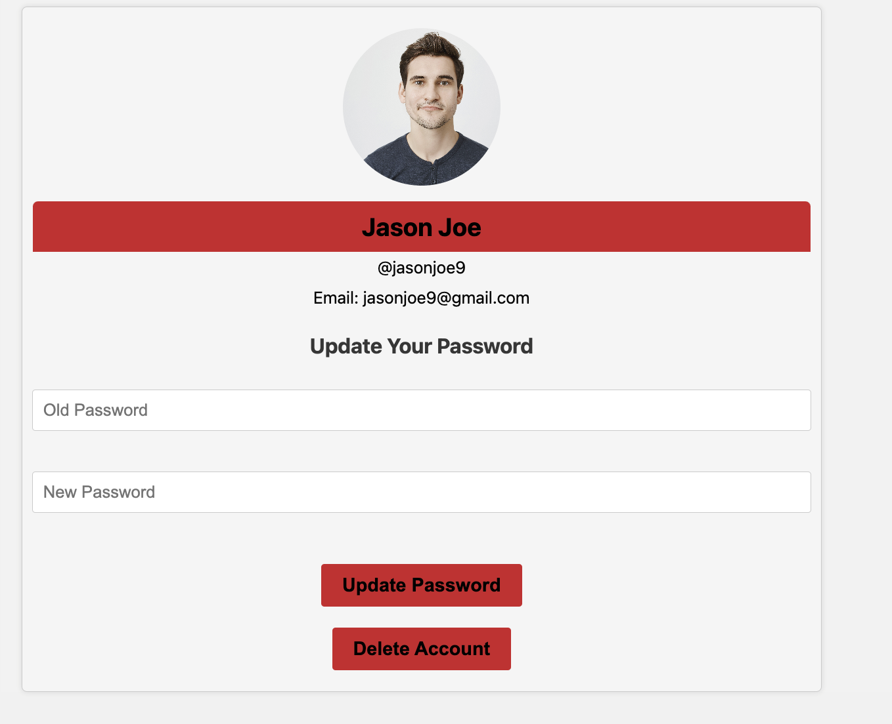
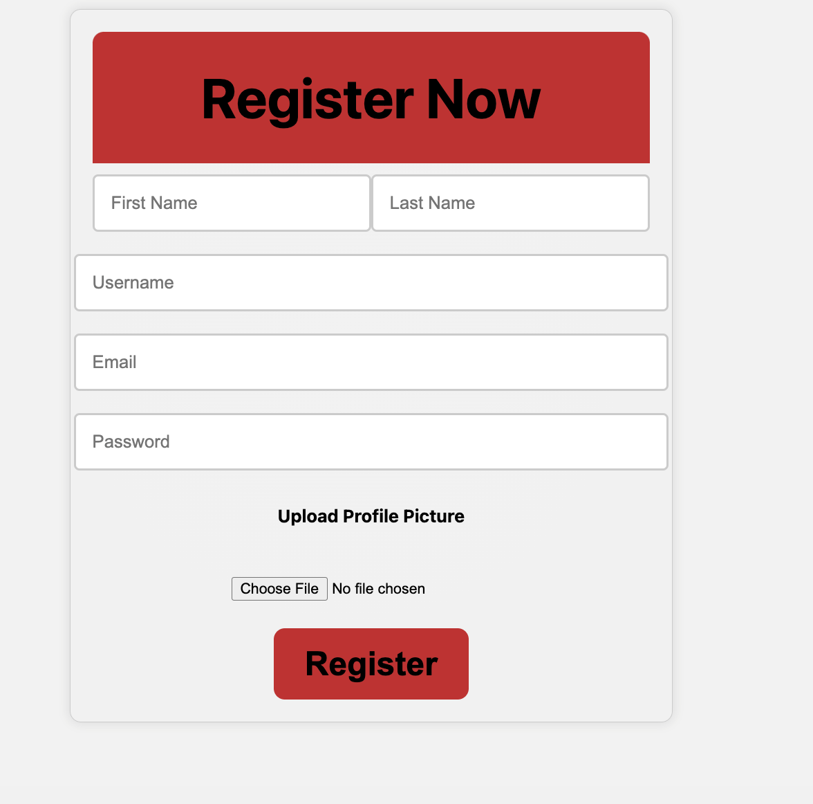
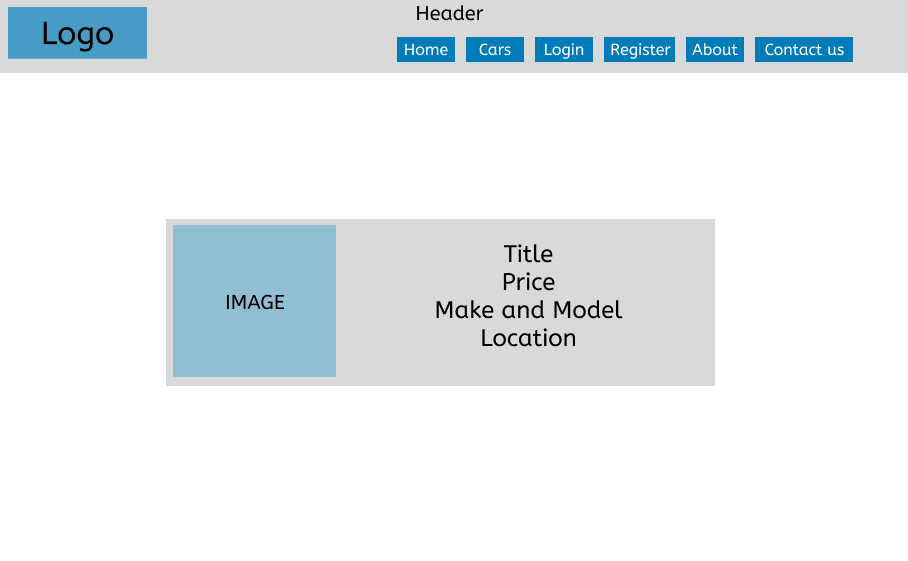
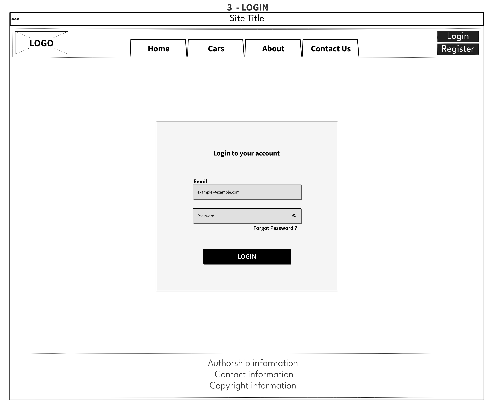
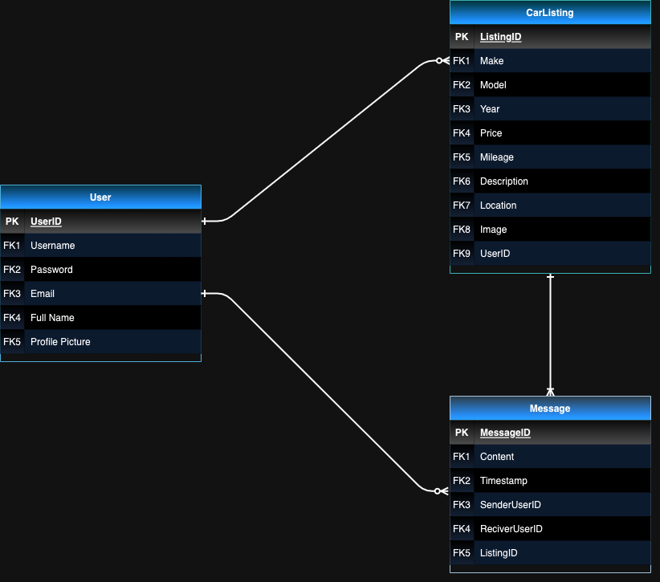

# 🚗 WiiWii - The Ultimate Online Car Marketplace 🚗

## 🌟 Introduction

WiiWii is your go-to platform for buying, selling, and exploring a wide range of cars. Whether you're an individual looking for your next vehicle or a dealer seeking an efficient platform to list your collection, WiiWii is designed for you.

## 🛠 Features

- **User Registration:Users can easily register, log in, update their passwords, and even delete their account if needed.**
- **Profile Management: Personalize your profile with the option to upload a profile picture.**
- **User Login**
- **User Update Password**
- **User Delete Account**:
- **User Upload Profile Picture**
- **Create Post**
- **Delete Post**
- **Comment**
- **Update Comment**
- **Delete Comment**

## 🙋‍♂️ Author Information

- **Name**: Majid Liaqat
- **Email**: [majidliaaqat@gmail.com](mailto:majidliaaqat@gmail.com)
- **LinkedIn**: [Majid Liaaqat](https://www.linkedin.com/in/majidliaaqat)

## 📜 Project Description

This MERN web app offers a seamless platform for users to manage profiles, create posts, and engage in discussions, all backed by secure authentication and a robust database.

## ⚙️ Technologies & Tools

- **Front-end**:
  - React
  - React Router
  - JWT (for user authentication)
- **Back-end**:
  - Node.js
  - Express
  - Mongoose
- **Database**:
  - MongoDB
- **Links**:
  - [GitHub](https://github.com/majidliaaqat)
  - [Front-end](https://github.com/majidliaaqat/wiiwii-server/)

## 🖼 Visual Overview

### Wireframe for the Front-end:

### Entity Relationship Diagram (ERD) for the Back-end:

### Component Hierarchy Diagram for the Front-end:

## Future Updates:

- Vehicle Verification
- Advanced Search Filters
- User Ratings & Reviews
- Chat System: Enable real-time messaging between buyers and sellers for direct communication.
- Alerts & Notifications
- Continuous Bug Fixes
- Enhanced User Experience

## 📌 Project Management

Track our progress, planned features, and development journey on our [Trello Board](https://trello.com/b/nuHI8ar3/wiiwii).
