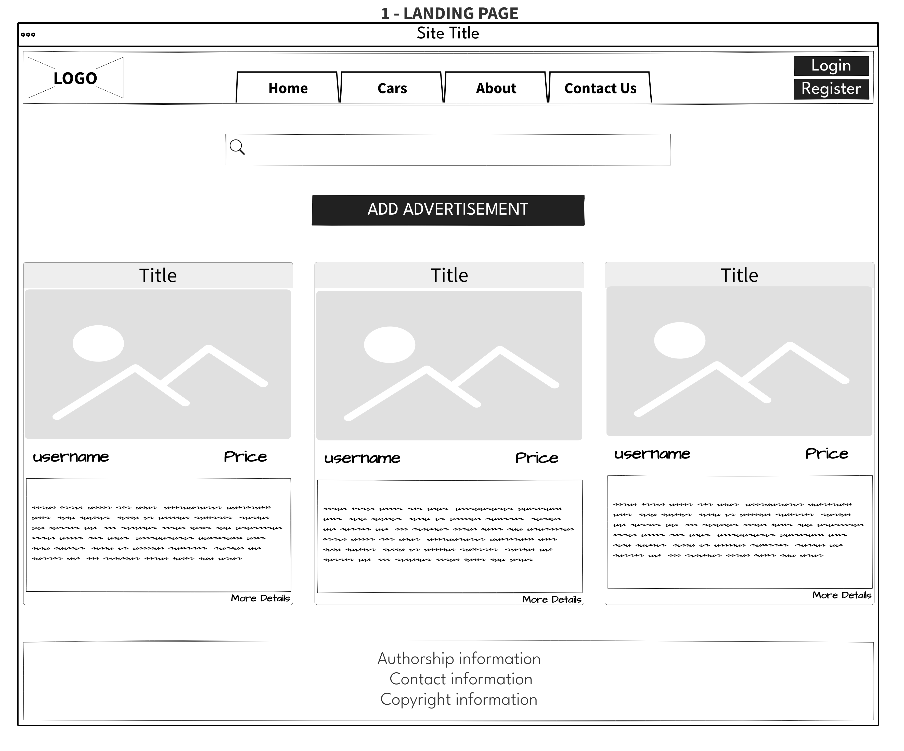

# 🚗 WiiWii - The Ultimate Online Car Marketplace 🚗

## 🌟 Introduction

WiiWii is your go-to platform for buying, selling, and exploring a wide range of cars. Whether you're an individual looking for your next vehicle or a dealer seeking an efficient platform to list your collection, WiiWii is designed for you.

## 🛠 Features

- **User Registration**: Sign up and get started in minutes.
- **Car Listings**: Explore list
- **Comment**: Directly communicate with buyers or sellers seamlessly.

## 🙋‍♂️ Author Information

- **Name**: Majid Liaqat
- **Email**: [majidliaaqat@gmail.com](mailto:majidliaaqat@gmail.com)
- **LinkedIn**: [Majid Liaaqat](https://www.linkedin.com/in/majidliaaqat)

## 📜 Project Description

At WiiWii, we prioritize user experience. With a sleek, responsive design and intuitive features, our platform ensures hassle-free trading of cars. Dive into a rich repository of vehicles, ranging from classic antiques to the latest models.

## ⚙️ Technologies & Tools

- **Front-end**:
  - React
  - React Router
  - JWT (for user authentication)
- **Back-end**:
  - Node.js
  - Express
  - Mongoose
- **Database**:
  - MongoDB
- **Deployment**:
  - Back-end hosted on [Render.com](https://render.com)
  - Front-end deployed via [Surge](https://surge.sh).

## 🖼 Visual Overview

### Wireframe for the Front-end:

### Entity Relationship Diagram (ERD) for the Back-end:

### Component Hierarchy Diagram for the Front-end:

## 📌 Project Management

Track our progress, planned features, and development journey on our [Trello Board](https://trello.com/b/nuHI8ar3/wiiwii).
